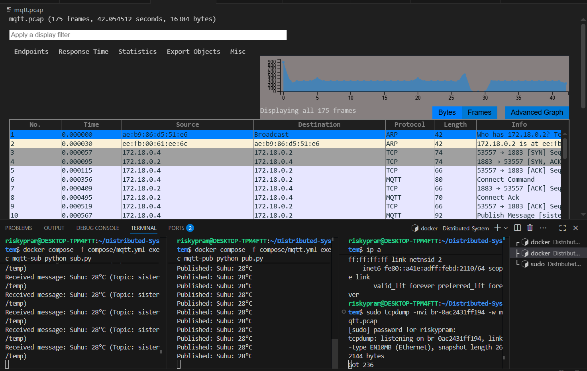

## MQQT (internal broker service)

step 1 : menjalankan command "docker compose -f compose/mqtt.yml up -d"  

step 2 : menjalankan command untuk subscriber "docker compose -f compose/mqtt.yml exec mqtt-sub python sub.py" 

step 3 : mengecek command dengan sintaks "ip a" untuk melihat interface bridge.

step 4 : menjalankan command "sudo tcpdump -nvi <kode_br> -w reqresp.pcap" untuk menyimpan dan melihat visualisasi pada wireshark.

step 5 : menjalankan command untuk Publish message "docker compose -f compose/mqtt.yml exec mqtt-pub python pub.py"

step 6 : setelah melakukan percobaan pada client, maka terdapat grafik analisis berupa extension pcap

## Analisa Grafik
Pada awal komunikasi, terlihat adanya proses ARP yang berfungsi untuk mengetahui alamat fisik (MAC address) dari host dengan IP 172.18.0.2. Setelah itu, koneksi TCP dibangun antara host 172.18.0.4 dan 172.18.0.2 melalui port 1883, yaitu port standar yang digunakan oleh protokol MQTT. Proses ini dimulai dengan tiga tahap handshake TCP (SYN, SYN-ACK, ACK) sehingga koneksi dasar dapat terbentuk secara andal.

Setelah TCP tersambung, host 172.18.0.4 mengirimkan MQTT Connect Command ke broker MQTT (172.18.0.2). Broker kemudian merespons dengan Connect Acknowledgment (Connack) sebagai tanda bahwa permintaan koneksi berhasil diterima. Tahap ini menunjukkan bahwa klien berhasil melakukan inisialisasi koneksi dengan broker MQTT.

Selanjutnya, terdapat beberapa paket MQTT Publish Message yang dikirimkan oleh klien ke broker. Pesan-pesan ini membawa data yang dipublikasikan ke sebuah topic, yang dalam tangkapan paket ditunjukkan dengan nama sistem/.... Artinya, klien berfungsi sebagai pengirim data (publisher) yang mengirimkan informasi ke broker untuk nantinya dapat didistribusikan ke subscriber lain jika ada.

Dalam aliran komunikasi ini, terlihat pula adanya balasan berupa TCP ACK dari pihak penerima setelah setiap pesan MQTT dikirimkan. Hal ini menandakan bahwa pengiriman pesan berlangsung normal, koneksi stabil, dan tidak ada indikasi error atau retransmisi.

