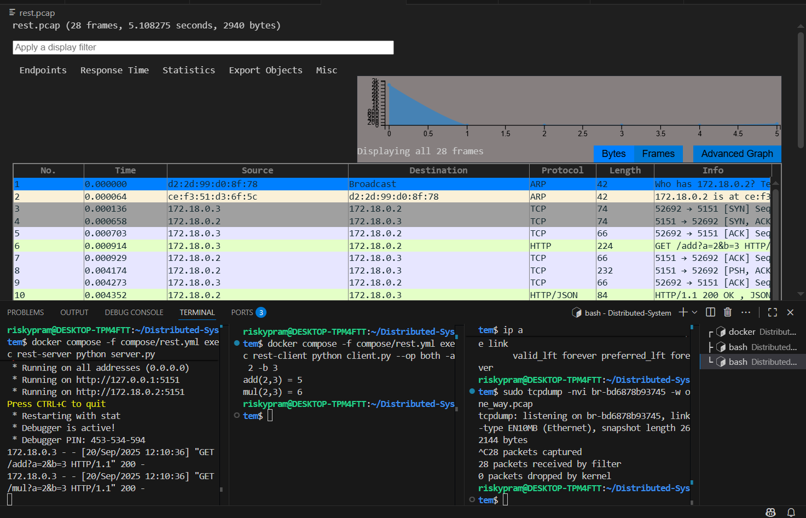

## REST

step 1 : menjalankan command "docker compose -f compose/rest.yml up -d"  

step 2 : menjalankan command untuk server "docker compose -f compose/rest.yml exec rest-server python server.py" 

step 3 : mengecek command dengan sintaks "ip a" untuk melihat interface bridge.

step 4 : menjalankan command "sudo tcpdump -nvi <kode_br> -w rest.pcap" untuk menyimpan dan melihat visualisasi pada wireshark.

step 5 : menjalankan command untuk client "docker compose -f compose/rest.yml exec rest-client python client.py --op both -a 2 -b 3"

step 6 : setelah melakukan percobaan pada client, maka terdapat grafik analisis berupa extension pcap

## Analisa Grafik

Komunikasi diawali dengan proses ARP, yaitu host d2:2d:99:d0:8f:78 melakukan broadcast untuk menanyakan siapa pemilik IP 172.18.0.2. Permintaan ini kemudian dijawab oleh host dengan alamat MAC ce:f3:51:d3:6f:5c, yang menyatakan bahwa ia adalah pemilik IP tersebut.

Setelah alamat fisik diketahui, koneksi TCP dibangun antara host 172.18.0.3 dengan 172.18.0.2. Terlihat adanya proses TCP three-way handshake: pertama 172.18.0.3 mengirimkan paket SYN, kemudian 172.18.0.2 merespons dengan SYN-ACK, dan diakhiri dengan ACK dari 172.18.0.3. Dengan demikian, koneksi TCP berhasil terbentuk di port 5151, yang di sini digunakan sebagai port layanan REST API.

Selanjutnya, host 172.18.0.3 mengirimkan HTTP request berupa "GET /add?a=2&b=3", Pesan ini menunjukkan bahwa klien sedang meminta layanan penjumlahan dua angka (2 + 3) kepada server. Paket ini diteruskan melalui protokol HTTP di atas koneksi TCP.

Server 172.18.0.2 kemudian membalas dengan HTTP Response yang berisi berupa "HTTP/1.1 200 OK , JSON", Balasan ini menunjukkan bahwa permintaan berhasil diproses (status code 200) dan hasilnya dikirim dalam format JSON. Dengan demikian, respons server berhasil diterima oleh klien.

Setelah pertukaran selesai, koneksi TCP diakhiri dengan proses FIN dan ACK antara kedua host, yang menandakan bahwa sesi komunikasi ditutup. Namun, pada bagian berikutnya terlihat koneksi TCP baru kembali dibuka oleh klien 172.18.0.3 dengan server 172.18.0.2. Pada hal ini ini, HTTP request yang dikirim adalah "GET /mul?a=2&b=3" yang berarti klien meminta operasi perkalian dua angka (2 × 3). Prosesnya kembali sama: server menerima permintaan melalui TCP, kemudian memberikan hasil perhitungan melalui HTTP response.

