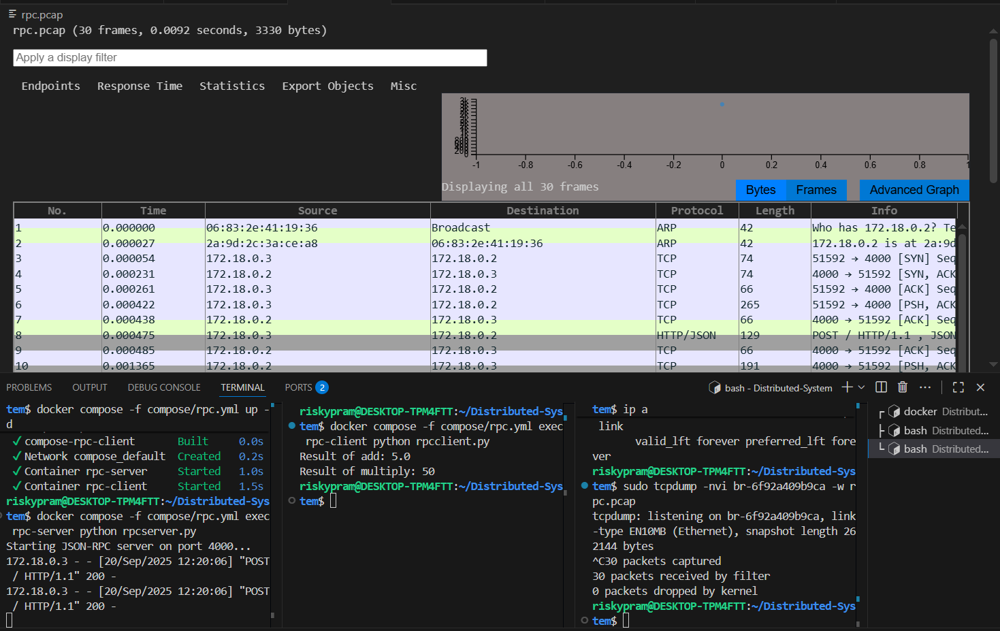

## RPC

step 1 : menjalankan command "docker compose -f compose/rpc.yml up -d"  

step 2 : menjalankan command untuk server "docker compose -f compose/rpc.yml exec rpc-server python rpcserver.py" 

step 3 : mengecek command dengan sintaks "ip a" untuk melihat interface bridge.

step 4 : menjalankan command "sudo tcpdump -nvi <kode_br> -w rpc.pcap" untuk menyimpan dan melihat visualisasi pada wireshark.

step 5 : menjalankan command untuk client "docker compose -f compose/rpc.yml exec rpc-client python rpcclient.py"

step 6 : setelah melakukan percobaan pada client, maka terdapat grafik analisis berupa extension pcap 

## Analisa Grafik

Pada tabel paket ini, komunikasi dimulai dengan proses ARP. Host dengan alamat MAC 06:83:2e:41:19:36 menanyakan siapa pemilik IP 172.18.0.2. Permintaan ini dijawab oleh host dengan alamat MAC 2a:9d:2c:3a:ce:a8, yang menyatakan dirinya sebagai pemilik IP tersebut. Proses ini memastikan klien mengetahui alamat fisik server sebelum komunikasi dilanjutkan.

Setelah itu, terjadi proses three-way handshake TCP antara klien 172.18.0.3 dengan server 172.18.0.2 pada port 4000. Handshake ini menandakan koneksi sudah berhasil dibangun sehingga komunikasi yang andal dapat dilakukan.

Begitu koneksi terbentuk, klien mengirimkan permintaan RPC kepada server. Permintaan ini dikemas dalam bentuk HTTP POST dengan isi data berupa JSON. JSON tersebut berisi instruksi pemanggilan prosedur beserta parameter yang dibutuhkan. Hal ini menunjukkan bahwa klien sedang melakukan panggilan fungsi jarak jauh (remote procedure call) ke server.

Server kemudian memproses permintaan tersebut dan mengembalikan respon RPC. Respon dikirim dalam format HTTP Response 200 OK dengan payload JSON yang berisi hasil eksekusi dari prosedur yang diminta. Dengan demikian, klien menerima hasil fungsi seolah-olah fungsi tersebut dijalankan secara lokal, padahal sebenarnya dijalankan di server.

Setelah proses pertukaran data selesai, koneksi TCP ditutup melalui mekanisme FIN dan ACK. Namun, pada tabel komunikasi ini terlihat bahwa setelah koneksi pertama ditutup, klien kembali membuka koneksi baru dengan server untuk melakukan pemanggilan RPC berikutnya.

