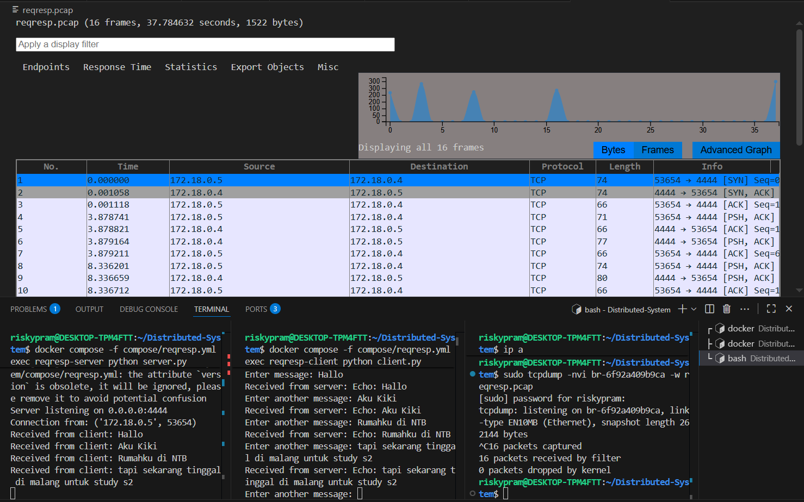

## TCP Req/Resp

step 1 : menjalankan command "docker compose -f compose/reqresp.yml up -d"  

step 2 : menjalankan command untuk server "docker compose -f compose/reqresp.yml exec reqresp-server python server.py" 

step 3 : mengecek command dengan sintaks "ip a" untuk melihat interface bridge.

step 4 : menjalankan command "sudo tcpdump -nvi <kode_br> -w reqresp.pcap" untuk menyimpan dan melihat visualisasi pada wireshark.

step 5 : menjalankan command untuk client "docker compose -f compose/reqresp.yml exec reqresp-client python client.py"

step 6 : setelah melakukan percobaan pada client, maka terdapat grafik analisis berupa extension pcap

## Grafik Hasil Visualisasi

Pada hasil Wireshark terlihat bahwa komunikasi antara client dengan server menggunakan protokol TCP berjalan dimana client dengan IP 172.18.0.5 mengirimkan pesan SYN ke server dengan IP 172.18.0.4 pada port 4444 untuk memulai koneksi. Server kemudian merespons dengan SYN, ACK sebagai tanda menerima permintaan tersebut, dan client membalas dengan ACK. Proses ini disebut 3-way handshake dan menandakan koneksi TCP telah berhasil dibentuk.

Setelah koneksi terjalin, client mulai mengirimkan data berupa pesan ke server. Pesan ini ditandai sebagai PSH, ACK yang artinya data segera dikirim tanpa menunggu buffer penuh. Setiap kali client mengirim pesan, server selalu memberikan balasan berupa ACK untuk memastikan data diterima.

Dalam data berikutnya terlihat adanya pertukaran data dua arah, di mana server tidak hanya mengirim ACK, tetapi juga membalas pesan dari client (misalnya dengan echo). Hal ini menggambarkan adanya mekanisme request-response berjalan dengan baik: client mengirim data, server menerimanya, lalu memberikan respons kembali.

sehingga dari hasil wireshark memperlihatkan alur komunikasi TCP yang utuh: dimulai dari pembentukan koneksi, pertukaran data antar client-server, hingga konfirmasi penerimaan data melalui paket ACK, tanpa ada error atau retransmisi.

