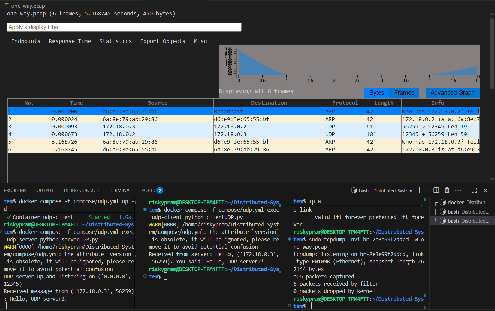

## UDP One-way

step 1 : menjalankan command "docker compose -f compose/udp.yml up -d"  

step 2 : menjalankan command untuk server "docker compose -f compose/udp.yml exec udp-server python serverUDP.py" 

step 3 : mengecek command dengan sintaks "ip a" untuk melihat interface bridge.

step 4 : menjalankan command "sudo tcpdump -nvi <kode_br> -w one_way.pcap" untuk menyimpan dan melihat visualisasi pada wireshark.

step 5 : menjalankan command untuk client "docker compose -f compose/udp.yml exec udp-client python clientUDP.py"

step 6 : setelah melakukan percobaan pada client, maka terdapat grafik analisis berupa extension pcap

## Analisa Grafik

Pada grafik dan tabel ini terlihat bahwa komunikasi dimulai dengan ARP. Host dengan alamat MAC d6:e9:3e:65:55:bf melakukan broadcast untuk menanyakan siapa pemilik alamat IP 172.18.0.2. Permintaan ini dijawab oleh host dengan MAC 6a:8e:79:ab:29:86, yang menyatakan bahwa IP 172.18.0.2 adalah miliknya. Proses ini memastikan bahwa alamat IP dapat dipetakan ke alamat fisik sebelum komunikasi berlanjut.

Setelah resolusi alamat berhasil, terlihat adanya komunikasi UDP. Host 172.18.0.3 mengirimkan sebuah pesan ke host 172.18.0.2 menggunakan port sumber 56259 dan port tujuan 12345. Pesan ini berukuran kecil (19 byte). Tidak lama kemudian, host 172.18.0.2 memberikan balasan berupa paket UDP kembali ke 172.18.0.3, kali ini dengan port sumber 12345 dan port tujuan 56259. Balasan yang dikirimkan memiliki ukuran lebih besar, yakni 59 byte. Hal ini menunjukkan adanya pola komunikasi request–response sederhana antara dua host, tetapi tetap dengan karakteristik UDP yang tidak memerlukan koneksi atau konfirmasi.

Selanjutnya, tampak kembali proses ARP yang dilakukan oleh host dengan MAC 6a:8e:79:ab:29:86 untuk menanyakan siapa pemilik IP 172.18.0.3. Permintaan ini dijawab oleh host d6:e9:3e:65:55:bf. Proses ARP ulang ini kemungkinan terjadi karena entri ARP di salah satu host sudah kadaluarsa.

Dengan demikian, komunikasi ini menunjukkan bagaimana UDP digunakan untuk pertukaran data yang cepat dan ringan. Paket dikirim secara langsung tanpa perlu negosiasi atau jaminan keandalan seperti pada TCP. Oleh karena itu, meskipun terjadi request–response, sifat komunikasi UDP tetap berupa one-way datagram, di mana setiap paket dikirim mandiri.

